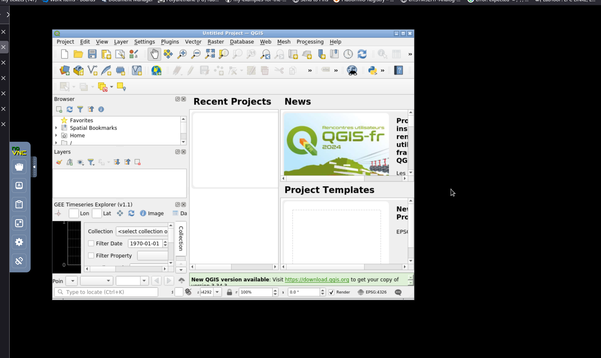
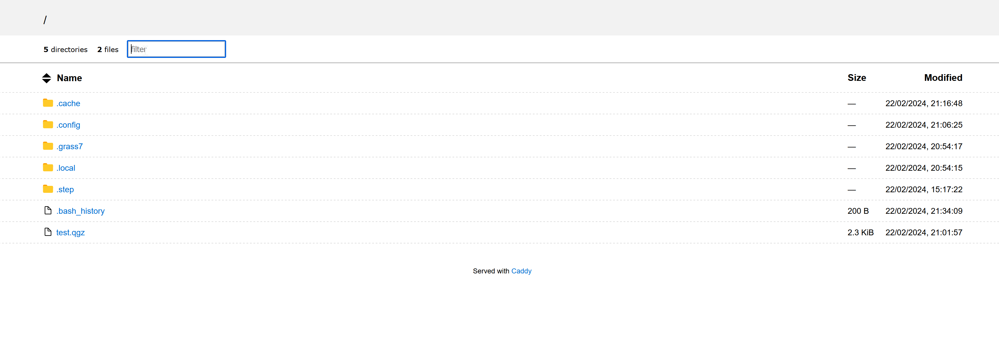

# Docker composition  to run QGIS desktop remotely on a server.

## Setup

### environment variables:
- APP_USER: username to login via browser
- APP_PASS_HASH: password to login via browser (hashed), to obtain this run `caddy hash-password -plaintext 'mypass'` in the caddy container.


Access through a browser (defaults to localhost:8080) reverse proxy as required.

## Usage
```bash
docker-compose up -d
```


- Home directory is mounted as /data
- access files via browser at localhost:8080/files 
- access the vnc as localhost:8080
- webdav is available at localhost:8080/webdav





